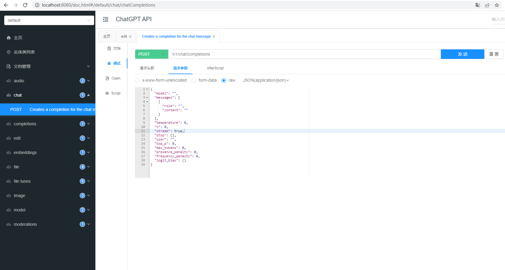

# OpenAI介绍
OpenAI是一家致力于研究人工智能的公司，他们开发了多个人工智能模型，包括自然语言处理、计算机视觉、语音合成等。这些模型在解决人工智能领域的问题时都有很好的表现，如GPT、GPT-2和GPT-3模型在自然语言生成方面表现突出。

对接OpenAI服务可以为应用程序提供强大的人工智能支持，帮助实现各种智能化场景。下面介绍一些常用的OpenAI服务。

OpenAI GPT模型
OpenAI GPT模型是一种基于transformer结构的自然语言处理模型，可以用于自然语言生成、文本摘要、对话生成等场景。通过对接OpenAI GPT模型，可以让应用程序自动生成文章、摘要、对话等文本，提高内容生成效率。

OpenAI Codex模型
OpenAI Codex模型是一种基于GPT的自动编码器，可以将自然语言描述转化为计算机代码。通过对接OpenAI Codex模型，可以实现智能编码辅助功能，例如自动代码生成、代码自动补全、自动重构等。

OpenAI DALL-E模型
OpenAI DALL-E模型是一种图像生成模型，可以根据自然语言描述生成对应的图像。通过对接OpenAI DALL-E模型，可以实现智能图像生成功能，例如根据用户描述自动生成产品图片、艺术设计等。

OpenAI GPT-3模型
OpenAI GPT-3模型是目前最先进的自然语言处理模型之一，可以应用于文本摘要、翻译、对话生成、文本分类等场景。通过对接OpenAI GPT-3模型，可以让应用程序具备更加智能化的自然语言处理能力，提高用户体验和效率。

对于对接OpenAI服务的应用程序，需要先注册OpenAI账号并获得API密钥，然后根据不同的服务接口，使用相应的SDK或API进行调用。同时，需要注意OpenAI服务的使用限制和计费规则，避免超出使用限制或产生不必要的费用。

该项目对接了opanai的api

## 支持的API包括
- [Models](https://platform.openai.com/docs/api-reference/models)
- [Completions](https://platform.openai.com/docs/api-reference/completions)
- [Chat Completions](https://platform.openai.com/docs/api-reference/chat/create)
- [Edits](https://platform.openai.com/docs/api-reference/edits)
- [Embeddings](https://platform.openai.com/docs/api-reference/embeddings)
- [Files](https://platform.openai.com/docs/api-reference/files)
- [Fine-tunes](https://platform.openai.com/docs/api-reference/fine-tunes)
- [Images](https://platform.openai.com/docs/api-reference/images)
- [Moderations](https://platform.openai.com/docs/api-reference/moderations)

## 启动服务之后可以通过localhost:8080/doc.html链接打开swagger文档如下


## 注意该服务需要部署在境外的服务器才能正常处理请求

## 另外需要把注册的secretKey配置在配置文件中，chatgpt-start.yaml配置文件内容如下
```
openai:
  secretKey: xxx
  organizationId: xxx
```